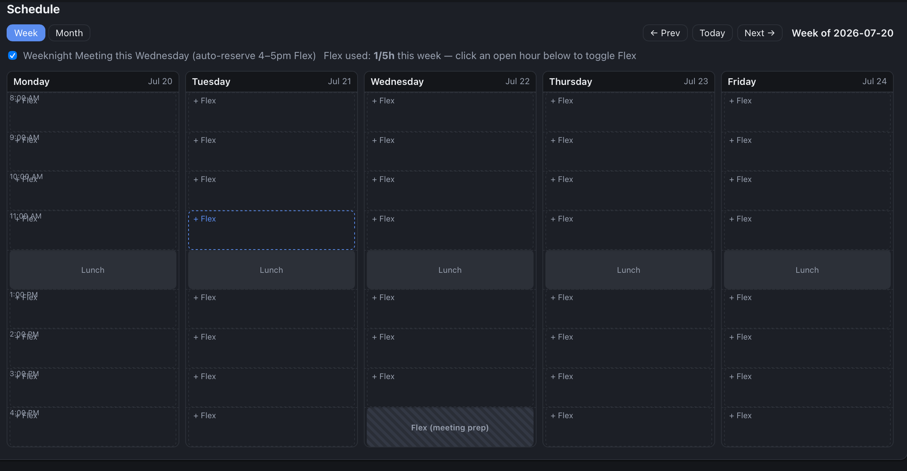
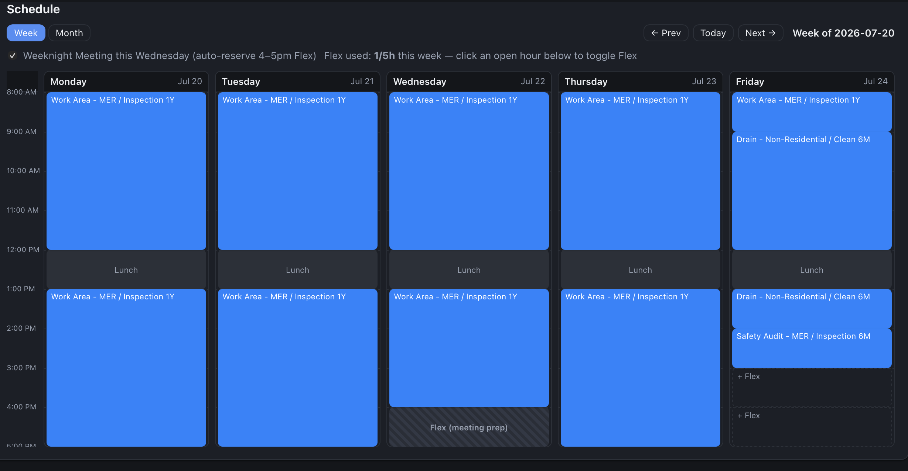

# Changelog

## 2026-07-18 — Week view: fixed overlapping time labels and scroll trapping

**The bug:** on the Schedule tab's Week view, Monday's hour labels (8:00 AM,
9:00 AM, ...) were rendered inside the same column as the "+ Flex" buttons,
so free hours showed both texts jumbled on top of each other.

**The fix:** moved the hour labels out of Monday's column into a single
shared time gutter on the left edge of the week grid, so no day column ever
renders label text again — it's just start times and task/flex blocks.

That surfaced two follow-on issues while testing:

1. The week grid started capturing vertical scroll (scrolling over it
   scrolled *inside* the grid instead of the page). Cause: `.week-grid` had
   `overflow-x: auto` with no `overflow-y` set, and per the CSS spec a
   scrollable x-axis silently forces the y-axis to `auto` too — a few
   pixels of label overflow past the bottom edge was enough to trigger it.

   

2. Fixing that with `overflow-y: hidden` correctly stopped the scroll
   trapping, but also clipped the "5:00 PM" label, which had been
   positioned to hang past the bottom boundary.

   

Re-anchoring that last label to the *bottom* of the box (`bottom: 0`)
instead of a top offset past the boundary fixed it for good — it now
renders fully inside the grid, no overflow, no scroll trapping.

